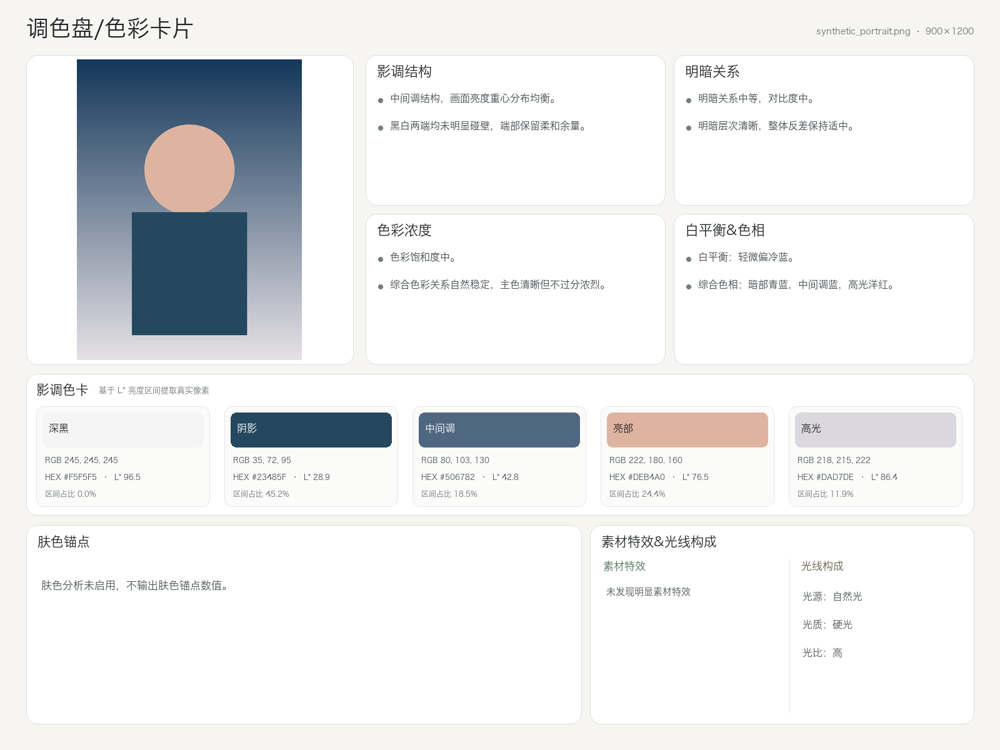

# 调色盘 / 色彩卡片

Local-first、Zero-token 的中文照片色彩分析工具。项目只分析照片，不自动调色、不套用 LUT、不调用 OpenAI API 或其他付费大模型接口，也不要求 API Key。

## 🚀 3 分钟开始使用

### 方法 A：使用 Codex（推荐新用户）

1. 在 GitHub Release 下载：
   `color-palette-codex-kit-v0.14.1.zip`

2. 解压 ZIP。

3. 把需要分析的照片复制到这个文件夹。

4. 使用 Codex 打开这个文件夹。

5. 打开 `CODEX_PROMPT.txt`，把内容发送给 Codex。

Codex 会自动：

- 检查 Python
- 安装调色盘
- 运行环境诊断
- 找到照片
- 执行本地分析
- 打开生成的 PNG 报告

调色盘分析引擎完全本地运行，不调用 OpenAI API。

详细图文步骤见 [Codex 快速体验指南](docs/CODEX_QUICKSTART.md)。

### 方法 B：命令行安装

需要 Python 3.10 或更高版本：

```bash
python -m pip install color_palette_skill-0.14.1-py3-none-any.whl
color-palette-doctor
color-palette photo.jpg --output ./result
```

## 结果示例

```text
输入照片
   ↓
Codex / CLI
   ↓
Local color analysis
   ↓
analysis.json
color_report.png
```

下面的报告来自程序生成的公开合成样片，不包含私人照片：



## 摄影知识 Consumer

本项目从中央摄影知识树读取色彩科学、调色、LUT、模拟边界、Rule ID 与 Evidence Status；中央知识树负责“知道什么”，本项目负责“如何分析和输出”。集成不复制中央 Memory，也不改变现有 Zero-token 图片分析与正式报告协议。

- Consumer 合同：[Photography Knowledge Consumer Contract](docs/PHOTOGRAPHY_KNOWLEDGE_CONTRACT.md)
- 本地集成检查：`python tools/photography_knowledge_smoke.py`
- 中央知识不可访问时必须报告 `knowledge source unavailable`，不得假装已读取。

## 核心输出

```text
output/
├── photo_analysis.json
└── photo_color_report.png
```

正式报告固定为 4:3、1600×1200，包含七个中文模块：

1. 影调结构
2. 明暗关系
3. 色彩浓度
4. 白平衡&色相
5. 影调色卡
6. 肤色锚点
7. 素材特效&光线构成

## 使用

```bash
color-palette photo.jpg --output ./result
```

默认使用 `opencv` 作为跨平台基线：

```bash
color-palette photo.jpg --output ./result --face-backend opencv
```

V0.14.x 的 OpenCV 依赖接受范围为 `>=4.14,<5`；核心 CI 对各平台实际解析到的
OpenCV 4.x 运行完整测试。OpenCV 5.x 尚未纳入兼容性承诺，待完成独立兼容测试后再放开上限。

其他选项：

```text
--face-backend auto     优先使用 dlib，缺失时安全降级
--face-backend dlib     请求 dlib，缺失时安全降级为 OpenCV
--face-backend none     关闭肤色分析，不影响核心色彩分析
--max-side 1600         设置分析副本最长边
```

## 环境诊断

```bash
color-palette-doctor
```

诊断内容包括：

- JPG / PNG / WebP 输入读取能力
- LittleCMS / ICC 色彩管理
- 中文字体
- OpenCV / dlib 人脸后端
- Python 与主要依赖版本
- Zero-token 与 PNG-only 输出契约

## 支持的输入格式与原图保真

- JPG / JPEG
- PNG：完全透明像素不参与分析
- WebP
- EXIF Orientation 自动修正
- 嵌入 ICC 时转换至 sRGB 工作空间

允许：方向修正、ICC 标准化、等比缩放、排版裁切。

禁止：曝光、白平衡、色相、饱和度、对比度调整；LUT、滤镜、美颜、锐化、降噪、柔焦、颗粒添加；生成式重绘。

## Material FX V0.13

素材特效模块会从最终图像的可见特征中进行多区域、多标签推断，当前支持：

- 细颗粒 / 粗颗粒；
- 柔化 / 高斯模糊 / 低清晰度；
- 高光扩散；
- RGB 色彩偏移；
- 画质降低 / Digital Low-fi；
- 胶片扫描质感、胶片边框、灰尘与划痕；
- 同一张照片同时显示多个效果。

分析会分别观察平坦区域、边缘区域、高光邻域，并排除自然景深、平滑肤色、
真实强逆光、数字噪点、JPEG 块效应和真实物体纹理等竞争解释。正式 PNG 只显示
简洁中文标签；内部置信度、证据与候选解释仅保存在 `analysis.json`。

Material FX 是基于最终图像视觉特征的推断，不保证还原作者真实使用的软件、滤镜或制作步骤。
完整分类、Schema 与排除规则见 [Material FX V0.13 规则](docs/MATERIAL_FX_V0.13.md)。

## Light Analysis V0.14

光线构成把三个维度独立分析：

- 光源：自然光、人工棚拍、人工闪光、混合光、自发光；
- 光质：硬光、柔光；
- 光比：低、中、高。

光质以主体 ROI 中的阴影边缘与半影宽度为核心；光比比较同一主体受光面与阴影面，
不复用全图对比度。烟花、霓虹、LED、灯具与火焰等自发光主体显示“光质：不适用、
光比：不适用”。综合色温只保留为内部辅助信息，不用于“偏暖即人工光、偏冷即自然光”
的捷径判断。

Light Analysis 根据最终成片可观察到的受光特征进行视觉推断，不保证还原真实摄影现场的
具体灯具型号、数量或精确灯位。完整规则见
[Light Analysis V0.14](docs/LIGHT_ANALYSIS_V0.14.md)。真实 A–F 图片只在仓库外本地验证：

```bash
python scripts/run_lighting_benchmark.py --input-dir /path/to/light_qa
```

Runner 从图片像素重新分析；只记录 SHA-256、固定 Ground Truth、程序 Actual 与
PASS/FAIL。FAIL 项附带分类置信度、证据、备选解释和分析区域，结果文件必须保存在仓库外。

## Golden Dataset

```bash
color-palette-golden ./my-images \
  --ground-truth ./ground_truth.json \
  --output ./golden_validation_report.json \
  --strict-missing
```

私人照片不进入公开仓库；验证按 SHA-256 在本地匹配。

## 公开示例与隐私

公开示例全部由程序生成，登记在：

```text
examples/public_examples_provenance.json  # 人工审核、生成器不可写
examples/public_examples_manifest.json
```

隐私扫描会同时校验两份登记；清单中的未知图片不能自行获得信任。

发布前运行：

```bash
python tools/privacy_scan.py .
```

## 开发者安装

仅参与源码开发时使用 editable install：

```bash
python -m pip install -e ".[dev]"
```

普通用户请优先下载 Codex Experience Kit 或正式 Wheel，不需要克隆仓库。

## 当前阶段

V0.14.1 Candidate：仅优化下载、安装与 Codex 快速体验；色彩分析、Light Analysis、Material FX、肤色算法、中文七模块和 PNG-only 协议均沿用 V0.14.0。

仓库配置了 Ubuntu、macOS、Windows 与 Python 3.10、3.12、3.13 的 GitHub Actions 矩阵。具体通过状态以当前 Pull Request 的 Actions 结果为准。

项目采用 [Apache-2.0](LICENSE) 许可证。发布准备请阅读
[v0.12.0 Beta Release Notes](docs/RELEASE_NOTES_V0.12.0.md)、
[合并后发布清单](docs/POST_MERGE_RELEASE_CHECKLIST_V0.12.md) 与
[真实用户 Beta 测试计划](docs/BETA_TEST_PLAN_V0.12.md)。

贡献前请阅读 [贡献指南](CONTRIBUTING.md) 与 [行为准则](CODE_OF_CONDUCT.md)；
安全问题和使用支持分别参见 [安全政策](SECURITY.md) 与 [支持说明](SUPPORT.md)。
